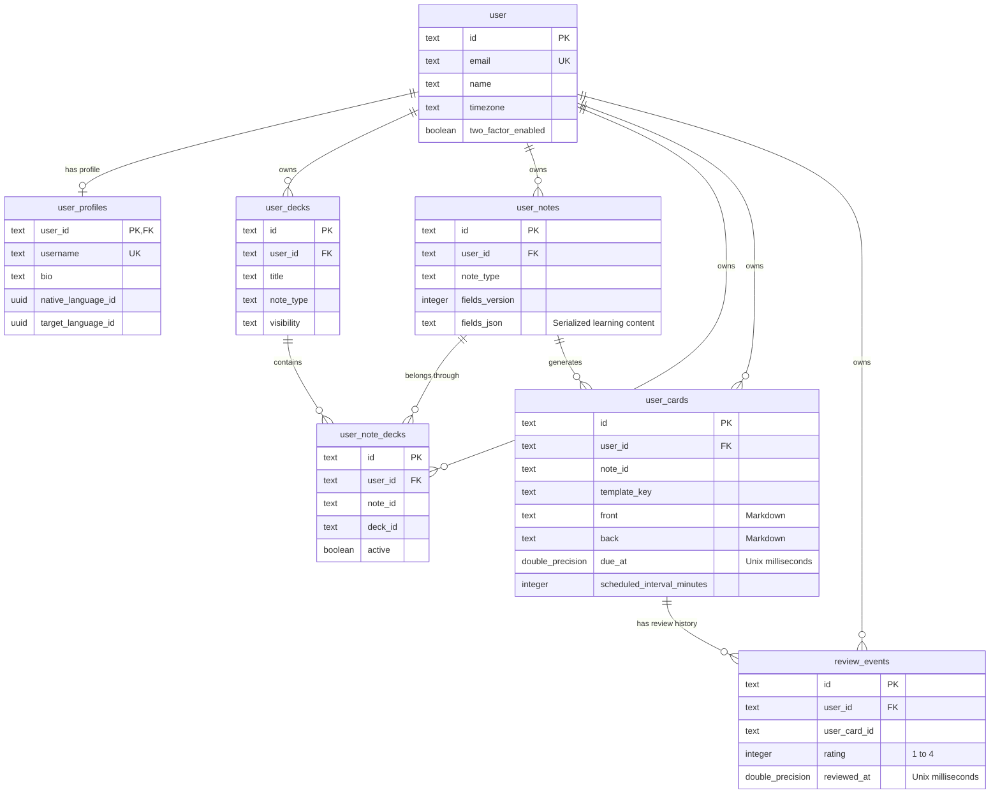

_This project has been created as part of the 42 curriculum by amoiseik, dgomez-a, pschneid, samcasti, tpandya._

# NotAnotherCards

## Description

NotAnotherCards is a language-learning application built around smart flashcards and spaced repetition. It provides web and mobile apps with deck and card management, offline synchronisation, AI-assisted card generation, authentication, and learning statistics.

## Instructions

### Prerequisites

- Docker with Docker Compose v2 for the containerised application.
- Node.js 24 or newer and pnpm 11 for local development.
- OpenSSL to generate a local authentication secret.

### Environment setup

From the repository root, copy the environment example:

```bash
cp .env.example .env
```

AI, Google OAuth, the VPS, Grafana, and production email are already configured. Ask a team member for the credentials or access you need. Add application credentials to the root `.env` for Docker, or to `apps/api/.env` for a local API. Keep these files out of Git.

Generate a local `BETTER_AUTH_SECRET` and paste the result into your environment file:

```bash
openssl rand -base64 32
```

Keep `POSTGRES_USER`, `POSTGRES_PASSWORD`, and `POSTGRES_DB` consistent with `DATABASE_URL`. Docker uses `postgres` as the database hostname, a local API uses `localhost`.

### Run with Docker

```bash
docker compose up --build --wait
```

Database migrations run automatically. Open the application at <http://localhost:5173> and the landing page at <http://localhost:5174>.

### Run locally

Copy the API environment example and add the local secret and credentials described above:

```bash
cp apps/api/.env.example apps/api/.env
```

Set `DATABASE_URL` in `apps/api/.env` to use `localhost` and the root `.env`'s `POSTGRES_PORT`. Then install dependencies, start PostgreSQL, apply migrations, and start the applications:

```bash
pnpm install
docker compose up -d postgres
pnpm --filter api db:migrate
pnpm dev
```

### Optional integrations

- **AI generation and moderation:** set `AI_API_BASE` and `AI_API_KEY` using the values supplied by a team member. Without the gateway, generation and deck publishing are unavailable. See [AI documentation](docs/ai-generation.md).
- **Google sign-in:** set the supplied `GOOGLE_CLIENT_ID` and `GOOGLE_CLIENT_SECRET`. If you change the local port or origin, ask the team to update the existing OAuth configuration. See [OAuth configuration](docs/oauth-setup.md).
- **Password-reset email:** use the team's email configuration or run Mailpit locally as shown below.

For Mailpit, set these values in your application environment file. Use `SMTP_HOST=localhost` when running the API locally.

```dotenv
RESEND_API_KEY=
SMTP_HOST=mail
SMTP_PORT=1025
SMTP_SECURE=false
```

Start the mail service and open <http://localhost:8025> to read emails:

```bash
docker compose --profile dev up -d mail
```

Restart the API after changing its environment. For Docker, use `docker compose up --wait api`.

### Production and monitoring

Production runs at <https://app.notanothercards.com>, with the landing page, [Privacy Policy](https://notanothercards.com/privacy), and [Terms of Service](https://notanothercards.com/terms) at <https://notanothercards.com>. Nginx provides HTTPS, the application containers use loopback ports. See [deployment architecture](docs/deployment.md) and the [VPS operations guide](infra/vps/README.md).

Grafana is available at <https://grafana.notanothercards.com>. Ask a team member for access. For local work on the monitoring stack, copy its environment example and fill in the values provided by the team:

```bash
cp infra/monitoring/.env.example infra/monitoring/.env
```

The [monitoring runbook](infra/monitoring/README.md) covers running and maintaining that stack.

### Common commands

- `pnpm dev`: start development tasks through Turbo.
- `pnpm build`: build all packages and applications.
- `pnpm lint`: check code style.
- `pnpm test`: run the workspace tests.
- `pnpm test:watch`: run tests in watch mode where supported.
- `pnpm format`: format JavaScript and TypeScript files.
- `pnpm e2e`: run the Chrome browser tests; first install Chrome with `pnpm --filter web exec playwright install chrome`.
- `pnpm test:infra`: validate infrastructure configuration.
- Mobile setup and builds: [docs/mobile.md](docs/mobile.md).

## Resources

### Project references

Official documentation for the frameworks, libraries, and services used in the project:

| Area                                     | References                                                                                                                                                                                                                                                                                                                                                                                                      |
| ---------------------------------------- | --------------------------------------------------------------------------------------------------------------------------------------------------------------------------------------------------------------------------------------------------------------------------------------------------------------------------------------------------------------------------------------------------------------- |
| Language and runtime                     | [TypeScript](https://www.typescriptlang.org/docs/), [Node.js](https://nodejs.org/docs/latest-v24.x/api/)                                                                                                                                                                                                                                                                                                        |
| Web applications                         | [React](https://react.dev/learn), [Vite](https://vite.dev/guide/), [TanStack Router](https://tanstack.com/router/latest/docs/overview),                                                                                                                                                                                                                                                                         |
| Styling and UI components                | [Tailwind CSS](https://tailwindcss.com/docs), [shadcn/ui](https://ui.shadcn.com/docs)                                                                                                                                                                                                                                                                                                                           |
| Backend                                  | [NestJS](https://docs.nestjs.com/)                                                                                                                                                                                                                                                                                                                                                                              |
| Mobile application                       | [React Native](https://reactnative.dev/docs/getting-started), [Expo](https://docs.expo.dev/), [Expo Router](https://docs.expo.dev/router/introduction/), [NativeWind](https://www.nativewind.dev/), [React Native Reusables](https://reactnativereusables.com/)                                                                                                                                                 |
| Database and offline synchronisation     | [PostgreSQL](https://www.postgresql.org/docs/), [Drizzle ORM](https://orm.drizzle.team/docs/overview), [SQLite](https://www.sqlite.org/docs.html), [Expo SQLite](https://docs.expo.dev/versions/latest/sdk/sqlite/), [RemelonDB](https://github.com/dustyway/remelonDB/blob/main/docs/README.md)                                                                                                                |
| Authentication, validation, and forms    | [Better Auth](https://www.better-auth.com/docs/introduction), [Zod](https://zod.dev/), [React Hook Form](https://react-hook-form.com/get-started)                                                                                                                                                                                                                                                               |
| Internationalisation                     | [i18next](https://www.i18next.com/overview/getting-started), [react-i18next](https://react.i18next.com/)                                                                                                                                                                                                                                                                                                        |
| AI gateway and model hosting             | [LiteLLM](https://docs.litellm.ai/docs/)                                                                                                                                                                                                                                                                                                                                                                        |
| Email delivery and local testing         | [Nodemailer](https://nodemailer.com/), [Resend](https://resend.com/docs/introduction), [Mailpit](https://mailpit.axllent.org/docs/)                                                                                                                                                                                                                                                                             |
| Automated tests                          | [Vitest](https://vitest.dev/guide/), [Jest](https://jestjs.io/docs/getting-started), [Testing Library](https://testing-library.com/docs/), [React Native Testing Library](https://oss.callstack.com/react-native-testing-library/), [Playwright](https://playwright.dev/docs/intro), [Supertest](https://github.com/forwardemail/supertest)                                                                     |
| Monorepo tooling                         | [pnpm](https://pnpm.io/motivation), [Turborepo](https://turborepo.dev/docs)                                                                                                                                                                                                                                                                                                                                     |
| Code quality                             | [ESLint](https://eslint.org/docs/latest/), [Prettier](https://prettier.io/docs/), [Knip](https://knip.dev/), [Madge](https://github.com/pahen/madge)                                                                                                                                                                                                                                                            |
| Containers, deployment, and networking   | [Docker](https://docs.docker.com/), [Docker Compose](https://docs.docker.com/compose/), [Nginx](https://nginx.org/en/docs/), [Tailscale](https://tailscale.com/docs), [Headscale](https://headscale.net/stable/), [Certbot](https://certbot.eff.org/instructions)                                                                                                                                               |
| Monitoring and alerts                    | [Prometheus](https://prometheus.io/docs/introduction/overview/), [Grafana](https://grafana.com/docs/grafana/latest/), [Alertmanager](https://prometheus.io/docs/alerting/latest/alertmanager/), [Node Exporter](https://github.com/prometheus/node_exporter), [PostgreSQL Exporter](https://github.com/prometheus-community/postgres_exporter), [NVIDIA DCGM Exporter](https://github.com/NVIDIA/dcgm-exporter) |
| Version control, CI, and mobile releases | [Git](https://git-scm.com/doc), [GitHub Actions](https://docs.github.com/en/actions), [F-Droid](https://f-droid.org/docs/)                                                                                                                                                                                                                                                                                      |

### AI tools

The team used AI to assist with the tasks listed below. Each member reviewed and adapted AI-generated output before including it in the project.

<!-- Each team member records the AI tools they used and the exact task they supported. -->

| Tool                                               | Task supported                                                                                                                                                                                               | Used by   |
| -------------------------------------------------- | ------------------------------------------------------------------------------------------------------------------------------------------------------------------------------------------------------------ | --------- |
| ChatGPT and Codex                                  | Code implementation, interface design, learning the JavaScript/TypeScript stack, and technical reference research.                                                                                           | @amoiseik |
| Codex CLI and Claude Code through T3 Code          | Implementation of offline synchronisation, web and mobile 2FA, gamification, and content moderation; assistance with tests, code review, and project documentation.                                          | @dgomez-a |
| ChatGPT and Gemini                                 | Code review, technical research and debugging.                                                                                                                                                               | @samcasti |
| opencode (free models)                             | API endpoints, continuous integration, VPS deployment, Prometheus and Grafana monitoring, and the two-factor authentication flow, using the Grafana, Prometheus, and Better Auth documentation as reference. | @tpandya  |
| Claude Code; opencode with ChatGPT and open models | Implementation help, tests, and code review for the mobile app, offline sync, content moderation, and the shared packages. Output was reviewed and adapted before use.                                       | @pschneid |

## Team Information

| Member    | Role and responsibility                                                                                                                                                                                                            |
| --------- | ---------------------------------------------------------------------------------------------------------------------------------------------------------------------------------------------------------------------------------- |
| @amoiseik | Product Owner, Project Manager, and Developer; spaced repetition engine (scheduler and review queue); web UI; deck views; landing page.                                                                                            |
| @dgomez-a | Technical Lead and Developer; monorepo foundations; database schemas and offline synchronisation API; web and mobile security; shared activity rules and gamification backend; mobile review; deployment support and code reviews. |
| @samcasti | Developer; web frontend; artificial intelligence features; gamification.                                                                                                                                                           |
| @tpandya  | Project Manager and Developer; API foundations and authentication; continuous integration, deployment, infrastructure, and monitoring; two-factor authentication; artificial intelligence features.                                |
| @pschneid | Developer; mobile application; shared architecture; integration; artificial intelligence features.                                                                                                                                 |

## Project Management

The team uses GitHub Issues and GitHub Projects to organise tasks. Pull Requests are reviewed before merging into main. The team communicates in Slack and meets once a week online or in person at 42 when possible.

The complete working agreement, including branch and review rules, is in [Team agreements](docs/team_agreements.md). Meeting decisions are recorded in [project-management meeting notes](docs/project-management/meetings/).

## Technical Stack

| Area                         | Technology                                       | Why we use it                                                                                                                                                      |
| :--------------------------- | :----------------------------------------------- | :----------------------------------------------------------------------------------------------------------------------------------------------------------------- |
| Web frontend                 | React, Vite, TypeScript, Tailwind CSS, shadcn/ui | React provides reusable components, Vite a fast development setup, and Tailwind with shadcn/ui consistent responsive UI.                                           |
| Backend                      | NestJS, TypeScript                               | NestJS provides a modular API structure, while TypeScript keeps contracts consistent with the frontend.                                                            |
| Authentication               | Better Auth                                      | Better Auth provides shared web and mobile authentication, session management, password recovery, social sign-in, and two-factor authentication with backup codes. |
| AI generation and moderation | LiteLLM, Ollama                                  | LiteLLM provides a common gateway for streamed and queued requests. Ollama hosts generation and moderation models for creating cards and checking shared content.  |
| Database                     | PostgreSQL, Drizzle ORM                          | PostgreSQL provides relational storage, while Drizzle adds typed schemas and queries in TypeScript.                                                                |
| Offline data                 | RemelonDB                                        | Keeps per-user learning data available offline on web and mobile and synchronises it through the API.                                                              |
| Mobile                       | Expo, React Native, expo-router, NativeWind      | Provides a native mobile app while reusing the project's React and TypeScript stack.                                                                               |
| Tests                        | Vitest, React Testing Library, Jest, Supertest   | Covers web components, backend code, and API behaviour.                                                                                                            |
| Tooling                      | pnpm, Turbo, Docker Compose, GitHub Actions      | Supports the monorepo, containerised development, and automated CI checks.                                                                                         |

## Database Schema

The application stores server data in PostgreSQL. A note holds learning content, cards generated from the note have their own learning schedules, decks group notes, and review events record answers. The web and mobile applications keep per-user local learning data for offline work and synchronise it with the API.

The diagram below shows the core account and learning tables with their key fields and data types. `PK` marks a primary key, `FK` a SQL foreign key, and `UK` a unique field.



For the complete details around the schemas, including authentication, AI, sharing, moderation, gamification, and sync bookkeeping tables, see [Database schemas](docs/db-schemas.md).

## Features List

<!-- Each feature must state what it does and who worked on it. -->

| Feature                               | What it does                                                                                                                                  | Contributors                                         |
| ------------------------------------- | --------------------------------------------------------------------------------------------------------------------------------------------- | ---------------------------------------------------- |
| Account management and social sign-in | Lets users register, sign in, keep a session, recover access, and use Google as a sign-in provider.                                           | @amoiseik, @dgomez-a, @samcasti, @tpandya, @pschneid |
| Two-factor authentication             | Lets users protect an account with time-based one-time passwords and backup codes.                                                            | @dgomez-a, @tpandya                                  |
| Password management and recovery      | Lets users reset a forgotten password by email and change their password while signed in.                                                     | @dgomez-a, @samcasti, @pschneid                      |
| User profile and preferences          | Lets users manage their profile, language, theme, and review preferences.                                                                     | @dgomez-a, @samcasti, @pschneid                      |
| Theme preferences                     | Lets users choose and retain a light or dark application theme.                                                                               | @samcasti, @pschneid                                 |
| Deck, note, and card management       | Lets a learner create, edit, organise, and delete decks, notes, and cards.                                                                    | @amoiseik, @dgomez-a, @samcasti, @tpandya, @pschneid |
| Starter sample decks                  | Provides ready-to-use learning decks that help a new learner begin studying.                                                                  | @amoiseik, @pschneid                                 |
| Word-note deck views                  | Displays word notes and their details in deck views, including compact counters, filtering, actions, and responsive layouts.                  | @amoiseik, @samcasti, @pschneid                      |
| Deck review session and answer modes  | Lets a learner start a deck-scoped review session, reveal cards, answer with ratings, use keyboard controls, and move through a review batch. | @amoiseik, @dgomez-a, @pschneid                      |
| Markdown card content                 | Renders formatted card fronts and backs on web and mobile, with shared validation for safe links and images.                                  | @dgomez-a, @samcasti                                 |
| Offline-first learning data           | Keeps each user's learning data locally available on web and mobile, then synchronises accepted changes with the API and PostgreSQL.          | @dgomez-a, @samcasti, @tpandya, @pschneid            |
| Community deck sharing                | Lets owners publish decks, lets learners import personal copies, and preserves ownership of an imported copy.                                 | @samcasti, @pschneid                                 |
| AI card generation                    | Creates card drafts from user input through queued generation jobs and a streamed web playground.                                             | @samcasti, @tpandya, @pschneid                       |
| AI content moderation                 | Checks published content, refuses unsafe content, supports reports and independent re-checks, and explains moderation decisions to owners.    | @dgomez-a, @pschneid                                 |
| Import and export                     | Exports learning data as JSON or CSV and imports validated data as one all-or-nothing operation.                                              | @samcasti                                            |
| Learning analytics                    | Shows due cards, dictionary size, review activity, streaks, forecasts, and card maturity, including while offline.                            | @dgomez-a, @samcasti, @pschneid                      |
| Gamification                          | Provides badges, global leaderboards, and daily challenges with persistent progress and feedback.                                             | @dgomez-a, @samcasti, @pschneid                      |
| Multiple languages                    | Provides a language switcher and translated user-facing text.                                                                                 | @amoiseik, @samcasti, @pschneid                      |
| Native mobile application             | Provides Android and iOS learning flows with local data, synchronisation, deck/card management, and review.                                   | @dgomez-a, @samcasti, @pschneid                      |
| Standalone landing application        | Provides a separate public marketing application, packaged with the project services and branded with the project identity.                   | @amoiseik, @tpandya                                  |
| Privacy Policy and Terms of Service   | Makes the required public legal information available from the landing application.                                                           | @amoiseik                                            |
| Production monitoring and alerts      | Collects infrastructure and application metrics, presents Grafana dashboards, and sends operational alerts to Slack.                          | @dgomez-a, @tpandya, @pschneid                       |

## Modules

The 13 modules below comprise four Major modules worth 2 points each and nine Minor modules worth 1 point each, for a total of 17 points. Each entry explains its purpose, implementation, and contributors. Detailed tracking is available in [Project requirements and progress](docs/requirements.md#4-claimed-modules).

| Module                                                          | Points   | Implementation and justification                                                                                                                                                                                              | Contributors                                         |
| --------------------------------------------------------------- | -------- | ----------------------------------------------------------------------------------------------------------------------------------------------------------------------------------------------------------------------------- | ---------------------------------------------------- |
| Web: framework for frontend and backend                         | Major, 2 | React provides reusable learning screens, and NestJS organises the API into feature modules. Both use TypeScript to keep contracts consistent.                                                                                | @amoiseik, @dgomez-a, @samcasti, @tpandya, @pschneid |
| Web: ORM for the database                                       | Minor, 1 | Drizzle provides typed PostgreSQL schemas, queries, and migrations to keep database access consistent.                                                                                                                        | @dgomez-a, @samcasti, @tpandya, @pschneid            |
| Web: custom design system                                       | Minor, 1 | A shared palette, Poppins typography, Lucide icons, and at least 10 reusable components keep the UI consistent. See the [design reference](docs/design.md).                                                                   | @amoiseik, @samcasti, @pschneid                      |
| User Management: OAuth 2.0                                      | Minor, 1 | Google sign-in through Better Auth simplifies account access and handles provider callbacks and sessions.                                                                                                                     | @amoiseik, @samcasti, @tpandya, @pschneid            |
| Artificial Intelligence: complete LLM system interface          | Major, 2 | Queued card generation and a streamed playground reduce manual preparation of learning material. The API handles gateway errors, usage quotas, and rate limits.                                                               | @samcasti, @tpandya, @pschneid                       |
| Data and Analytics: data export and import                      | Minor, 1 | JSON and CSV exports let learners back up their material. Imports use Zod validation and integrity checks, with bulk changes applied in one transaction.                                                                      | @samcasti                                            |
| Gaming and user experience: gamification                        | Minor, 1 | Badges, global leaderboards, and daily challenges encourage regular study, with persistent progress, visual feedback, and defined progression rules.                                                                          | @dgomez-a, @samcasti, @pschneid                      |
| Modules of choice: mobile app                                   | Major, 2 | The native Expo/React Native app supports study away from a desktop, with account isolation, offline data, synchronisation, and deck/card review. Its scope is explained below.                                               | @dgomez-a, @samcasti, @pschneid                      |
| DevOps: monitoring with Prometheus and Grafana                  | Major, 2 | Prometheus exporters, custom Grafana dashboards, and Slack alerts help identify application and infrastructure failures. Grafana requires authentication and HTTPS. See the [monitoring runbook](infra/monitoring/README.md). | @dgomez-a, @tpandya, @pschneid                       |
| User Management: user activity analytics and insights dashboard | Minor, 1 | Offline statistics show due cards, dictionary size, streaks, review activity, forecasts, and card maturity to help learners track progress.                                                                                   | @dgomez-a, @samcasti, @pschneid                      |
| Accessibility and Internationalization: multiple languages      | Minor, 1 | Shared English, German, Spanish, and Russian translations, a language switcher, and localized formatting make the app usable in different native languages.                                                                   | @amoiseik, @samcasti, @pschneid                      |
| User Management: 2FA                                            | Minor, 1 | Better Auth adds account protection through TOTP enrollment, sign-in challenges, backup codes, and disabling 2FA, with web and mobile screens.                                                                                | @dgomez-a, @tpandya                                  |
| Artificial Intelligence: content moderation AI                  | Minor, 1 | AI checks published decks, refuses unsafe content, and re-checks reports to protect community content. Owners can inspect verdicts and explanations. See [moderation](docs/ai-generation.md#moderation-at-publish).           | @dgomez-a, @pschneid                                 |

### Native mobile application

The native app supports short study sessions on Android and iOS, including offline use. Each account has its own local database; edits and reviews persist on the device and synchronise with the API. Shared schemas and study rules keep web and mobile behaviour consistent.

Its Major scope (2 points) comes from combining native navigation, authentication and 2FA, account isolation, deck/card management, review scheduling, and synchronisation across devices. See the [mobile guide](docs/mobile.md) and [local database contract](docs/db-schemas.md#local-database-contract).

## Individual Contributions

### @amoiseik

Product Owner and Developer. Defined the product scope, spaced repetition requirements, and review flow. Worked on the web UI, deck views, and landing page.
Challenge: Started without practical experience with JavaScript/TypeScript or collaborative GitHub workflows and learned the required stack and workflow while working on the project.

### @dgomez-a

Technical Lead and Developer. Set up the monorepo and worked on database schemas, offline synchronisation, web and mobile 2FA, gamification APIs, mobile reviews, and content moderation. Helped plan milestones and tickets, supported deployment, and reviewed code across the project.

A technical challenge was keeping data and account security consistent across the API, web, and mobile during offline use and synchronisation. Addressed this through shared validation rules, session guards, and integration tests.

### @samcasti

@samcasti is the main Frontend developer. He led the implementation of the core web dashboard, user profile and settings, bringing the user interface to life with a custom design system and reactive components. His major feature contributions include the gamification system (badges, leaderboards, and daily challenges), the Playground tab for AI-assisted card generation, the global internationalization (i18n) setup with multiple language translations, and the reactivity layer that drives the offline-first data synchronization and local database operations.

Challenge: making web and mobile share the exact same database schema and offline logic. Implemented sqlite-wasm on OPFS in a Web Worker through RemelonDB's web driver so both web and phone use SQLite, with multi tab access handled by the library's lease.

### @tpandya

@tpandya handled the API, CI/CD, deployment, and monitoring. He implemented Better Auth, database schemas, AI job queues, Prometheus/Grafana monitoring, VPS deployment, HTTPS, and 2FA. He ensured reliability through automated validation scripts and end-to-end tests.

Challenge: monitoring, deployment configuration, and API code all changed at the same time quite quickly so implementing appropriate tests was quite challenging for me, in the end we addressed this issue with validation script for infra. The grafana, prometheus, and Better Auth documentation was consulted through opencode. Additionally adapting to learning pace was bit tough as well.

### @pschneid

Worked on the mobile app, offline sync, the AI gateway, content moderation, the shared packages, and the web deck views.

Challenge: learning had to work without internet on both the phone and the web, and both apps had to behave the same. Each app keeps the user's cards on the device, saves reviews there first, and syncs when the connection is back. If the same card was changed on two devices, the server decides which change is kept. The review rules and checks live in shared packages that both apps use, so they are written once.
