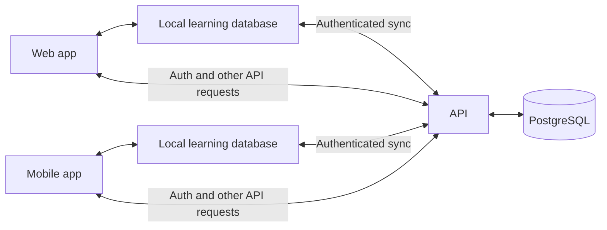
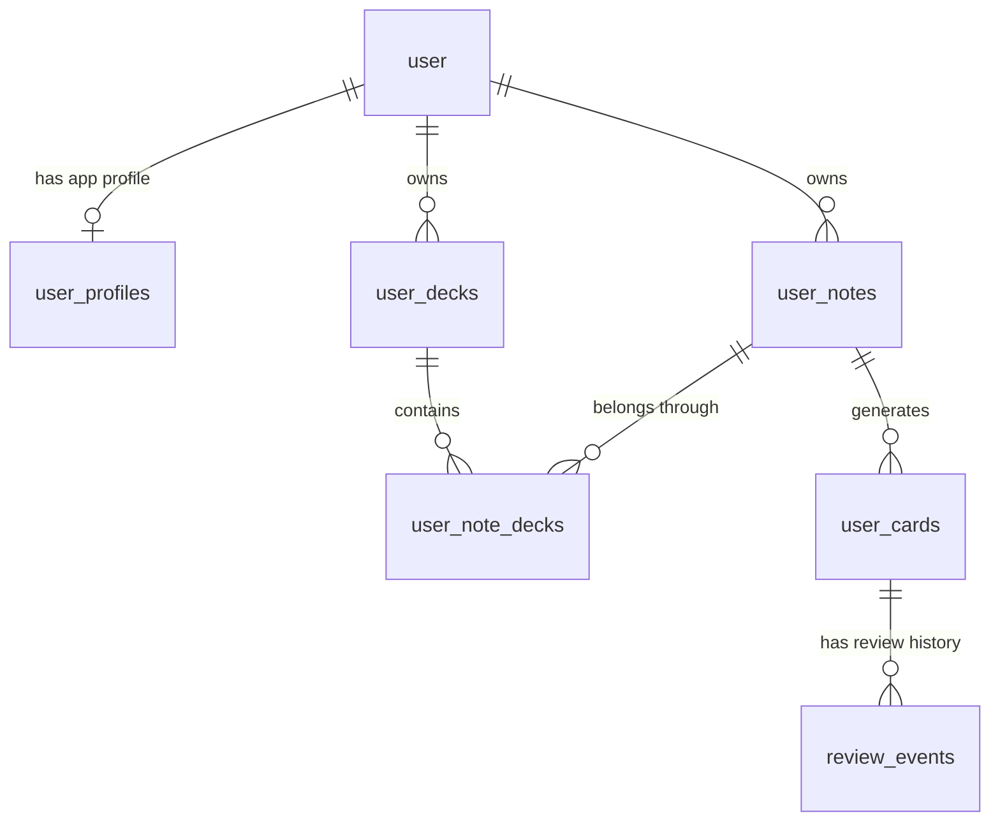

# Database schemas

Implemented persistence only. Tables that are not built yet are in
[Database schema proposals](db-schema-proposals.md). The table blocks below are
generated from this branch's Drizzle snapshot, not read from a deployed database.

## How the data fits together

A **note** holds what you want to learn. **Cards** are the questions generated
from a note, each with its own schedule. **Review events** record your answers.
**Decks** group notes without copying them or their progress.

PostgreSQL holds the server data. Web and mobile each keep a local RemelonDB
database per signed-in user, so reviewing works offline; when connected, they
push local changes to the API and pull accepted ones back. Sync only covers the
user's own learning records, and the server checks ownership before accepting a
push. Auth, published decks, moderation, AI jobs and gamification awards live in
server-only tables behind API endpoints.



### Example: learning “Haus”

An English speaker adds the German word “Haus” (“house”) to a “German basics”
deck:

1. A `user_notes` row stores a `word@1` note. Its `fields_json` holds `word`,
   `translation`, the native/target language ids and any optional word fields.
2. The note compiler generates `user_cards` rows for word→translation and
   translation→word, plus an example card when both example fields are filled.
   Each card has its own `due_at` and `scheduled_interval_minutes`.
3. A `user_note_decks` row links the note to “German basics”. Adding it to a
   second deck, “Buildings”, adds another membership; the note and its cards
   stay the same, so progress is shared across both decks.
4. Reviewing a card records a `review_events` row with the rating and time, and
   updates that card's schedule. This happens locally and syncs later.
5. Editing “Haus” edits the note. Regenerating updates its cards in place,
   keeping their ids, schedules and review history.



Only the edges from `user` are SQL foreign keys. Card→note, membership→note/deck
and review→card are checked in [sync validation](../apps/api/src/sync/sync-validation.ts).

## Storage boundaries

| Category                     | Examples                                                                                                    | How the client uses it                                                             |
| ---------------------------- | ----------------------------------------------------------------------------------------------------------- | ---------------------------------------------------------------------------------- |
| Synced learning data         | Notes, cards, decks, memberships, review events, profiles                                                   | Reads and writes local records; sync exchanges accepted changes with the server    |
| Server-only application data | Auth records, AI jobs/usage, published decks, moderation records, badge awards, daily challenge completions | Calls the relevant API; these tables are not part of the current local sync schema |
| Device-local preferences     | Theme; web review mode and interval display                                                                 | Saves locally without cross-device sync                                            |
| Server sync bookkeeping      | Revision sequence, revision checkpoints, garbage-collection floor                                           | Used by the sync service, not exposed as local application tables                  |

## Current architecture

Each block lists a table's columns alphabetically with type, nullability and
default, then its indexes, keys, foreign keys and checks, as the snapshot
records them.

### Better Auth tables (server only)

These tables are generated and managed by Better Auth. Changes to authentication fields should be made through the Better Auth configuration and generation workflow, not by editing [`apps/api/src/database/schema.ts`](../apps/api/src/database/schema.ts).

#### `user` ([API schema](../apps/api/src/database/schema.ts))

<!-- schema:table:public.user -->

```text
TABLE "public"."user" RLS DISABLED
"created_at" timestamp NOT NULL DEFAULT now()
"email" text NOT NULL
"email_verified" boolean NOT NULL DEFAULT false
"id" text NOT NULL PRIMARY KEY
"image" text NULL
"name" text NOT NULL
"on_boarding_complete" boolean NOT NULL DEFAULT false
"timezone" text NULL DEFAULT 'UTC'
"two_factor_enabled" boolean NULL DEFAULT false
"updated_at" timestamp NOT NULL DEFAULT now()
UNIQUE "user_email_unique" ("email") NULLS DISTINCT
```

<!-- /schema -->

#### `session` ([API schema](../apps/api/src/database/schema.ts))

<!-- schema:table:public.session -->

```text
TABLE "public"."session" RLS DISABLED
"created_at" timestamp NOT NULL DEFAULT now()
"expires_at" timestamp NOT NULL
"id" text NOT NULL PRIMARY KEY
"ip_address" text NULL
"token" text NOT NULL
"updated_at" timestamp NOT NULL
"user_agent" text NULL
"user_id" text NOT NULL
INDEX "session_userId_idx" USING btree ("user_id" ASC NULLS LAST)
UNIQUE "session_token_unique" ("token") NULLS DISTINCT
FOREIGN KEY "session_user_id_user_id_fk" ("user_id") REFERENCES "public"."user" ("id") ON DELETE CASCADE ON UPDATE NO ACTION
```

<!-- /schema -->

#### `account` ([API schema](../apps/api/src/database/schema.ts))

<!-- schema:table:public.account -->

```text
TABLE "public"."account" RLS DISABLED
"access_token" text NULL
"access_token_expires_at" timestamp NULL
"account_id" text NOT NULL
"created_at" timestamp NOT NULL DEFAULT now()
"id" text NOT NULL PRIMARY KEY
"id_token" text NULL
"password" text NULL
"provider_id" text NOT NULL
"refresh_token" text NULL
"refresh_token_expires_at" timestamp NULL
"scope" text NULL
"updated_at" timestamp NOT NULL
"user_id" text NOT NULL
INDEX "account_userId_idx" USING btree ("user_id" ASC NULLS LAST)
FOREIGN KEY "account_user_id_user_id_fk" ("user_id") REFERENCES "public"."user" ("id") ON DELETE CASCADE ON UPDATE NO ACTION
```

<!-- /schema -->

#### `verification` ([API schema](../apps/api/src/database/schema.ts))

<!-- schema:table:public.verification -->

```text
TABLE "public"."verification" RLS DISABLED
"created_at" timestamp NOT NULL DEFAULT now()
"expires_at" timestamp NOT NULL
"id" text NOT NULL PRIMARY KEY
"identifier" text NOT NULL
"updated_at" timestamp NOT NULL DEFAULT now()
"value" text NOT NULL
INDEX "verification_identifier_idx" USING btree ("identifier" ASC NULLS LAST)
```

<!-- /schema -->

#### `two_factor` ([API schema](../apps/api/src/database/schema.ts))

Managed by Better Auth's `twoFactor` plugin (see the API README). `secret`
and `backup_codes` are encrypted at rest; never read them for display or
logging.

<!-- schema:table:public.two_factor -->

```text
TABLE "public"."two_factor" RLS DISABLED
"backup_codes" text NOT NULL
"failed_verification_count" integer NULL DEFAULT 0
"id" text NOT NULL PRIMARY KEY
"locked_until" timestamp NULL
"secret" text NOT NULL
"user_id" text NOT NULL
"verified" boolean NULL DEFAULT true
INDEX "twoFactor_secret_idx" USING btree ("secret" ASC NULLS LAST)
INDEX "twoFactor_userId_idx" USING btree ("user_id" ASC NULLS LAST)
FOREIGN KEY "two_factor_user_id_user_id_fk" ("user_id") REFERENCES "public"."user" ("id") ON DELETE CASCADE ON UPDATE NO ACTION
```

<!-- /schema -->

### Synchronized application tables

The synchronized contract consists of the following six logical tables. The
API schema adds `user_id`, `rev`, and `deleted_at` for ownership, revision
tracking, and tombstones. RemelonDB supplies its own local record metadata, so
those server columns are not application fields in the local Zod tables.

All numeric application timestamps (`due_at`, `created_at`, `updated_at`, and `reviewed_at`) are non-negative integer Unix milliseconds and must remain within JavaScript's safe-integer range. PostgreSQL stores them as `double precision`; the wire and local schemas validate them as integers found in [`apps/api/src/sync/schema.ts`](../apps/api/src/sync/schema.ts).

#### `user_decks` ([API schema](../apps/api/src/sync/schema.ts), [local schema](../packages/offline-db/src/user-dictionary.ts))

A deck says which note contract its notes follow (`note_type`, migration
`0011`, local schema v4) and whether it is shared (`visibility`, migration
`0012`, local schema v5). `note_type` is insert-only and must name a
registered type; a word deck carries the two language ids its note form
defaults from, a basic deck carries none (check constraint). `visibility` is
server-owned: sync accepts a row that keeps `public`, but a client cannot
publish by pushing `public`; that happens through the sharing API, which also
writes the snapshot in `published_decks`.

<!-- schema:table:public.user_decks -->

```text
TABLE "public"."user_decks" RLS DISABLED
"created_at" double precision NOT NULL
"deleted_at" timestamp with time zone NULL
"description" text NULL
"id" text NOT NULL PRIMARY KEY
"native_language_id" uuid NULL
"note_type" text NOT NULL
"rev" bigint NOT NULL
"target_language_id" uuid NULL
"title" text NOT NULL
"updated_at" double precision NOT NULL
"user_id" text NOT NULL
"visibility" text NOT NULL DEFAULT 'private'
INDEX "user_decks_user_rev_idx" USING btree ("user_id" ASC NULLS LAST, "rev" ASC NULLS LAST)
INDEX "user_decks_user_updated_idx" USING btree ("user_id" ASC NULLS LAST, "updated_at" ASC NULLS LAST)
FOREIGN KEY "user_decks_user_id_user_id_fk" ("user_id") REFERENCES "public"."user" ("id") ON DELETE CASCADE ON UPDATE NO ACTION
CHECK "user_decks_created_at_safe_integer_check": "user_decks"."created_at" >= 0 and "user_decks"."created_at" <= 9007199254740991 and "user_decks"."created_at" = trunc("user_decks"."created_at")
CHECK "user_decks_languages_match_note_type_check": case when "user_decks"."note_type" = 'word' then "user_decks"."native_language_id" is not null and "user_decks"."target_language_id" is not null and "user_decks"."native_language_id" <> "user_decks"."target_language_id" else "user_decks"."native_language_id" is null and "user_decks"."target_language_id" is null end
CHECK "user_decks_updated_at_safe_integer_check": "user_decks"."updated_at" >= 0 and "user_decks"."updated_at" <= 9007199254740991 and "user_decks"."updated_at" = trunc("user_decks"."updated_at")
CHECK "user_decks_visibility_check": "user_decks"."visibility" in ('private', 'public')
```

<!-- /schema -->

#### `user_notes` ([API schema](../apps/api/src/sync/schema.ts), [local schema](../packages/offline-db/src/user-dictionary.ts))

The canonical source for a learning item. `fields_json` is serialized JSON;
`additional_content` is optional Markdown for genuinely free-form material.

<!-- schema:table:public.user_notes -->

```text
TABLE "public"."user_notes" RLS DISABLED
"additional_content" text NULL
"created_at" double precision NOT NULL
"deleted_at" timestamp with time zone NULL
"fields_json" text NOT NULL
"fields_version" integer NOT NULL
"id" text NOT NULL PRIMARY KEY
"note_type" text NOT NULL
"rev" bigint NOT NULL
"updated_at" double precision NOT NULL
"user_id" text NOT NULL
INDEX "user_notes_user_rev_idx" USING btree ("user_id" ASC NULLS LAST, "rev" ASC NULLS LAST)
INDEX "user_notes_user_updated_idx" USING btree ("user_id" ASC NULLS LAST, "updated_at" ASC NULLS LAST)
FOREIGN KEY "user_notes_user_id_user_id_fk" ("user_id") REFERENCES "public"."user" ("id") ON DELETE CASCADE ON UPDATE NO ACTION
CHECK "user_notes_created_at_safe_integer_check": "user_notes"."created_at" >= 0 and "user_notes"."created_at" <= 9007199254740991 and "user_notes"."created_at" = trunc("user_notes"."created_at")
CHECK "user_notes_updated_at_safe_integer_check": "user_notes"."updated_at" >= 0 and "user_notes"."updated_at" <= 9007199254740991 and "user_notes"."updated_at" = trunc("user_notes"."updated_at")
```

<!-- /schema -->

#### `user_cards` ([API schema](../apps/api/src/sync/schema.ts), [local schema](../packages/offline-db/src/user-dictionary.ts))

Generated review questions. `front` and `back` deliberately remain generic
Markdown instead of encoding subject-specific fields in this table. Every
persisted card belongs to a note and has a stable template key.

<!-- schema:table:public.user_cards -->

```text
TABLE "public"."user_cards" RLS DISABLED
"active" boolean NOT NULL DEFAULT true
"back" text NOT NULL
"created_at" double precision NOT NULL
"deleted_at" timestamp with time zone NULL
"due_at" double precision NOT NULL
"front" text NOT NULL
"id" text NOT NULL PRIMARY KEY
"note_id" text NOT NULL
"rev" bigint NOT NULL
"scheduled_interval_minutes" integer NOT NULL DEFAULT 0
"template_key" text NOT NULL
"updated_at" double precision NOT NULL
"user_id" text NOT NULL
INDEX "user_cards_note_idx" USING btree ("note_id" ASC NULLS LAST)
INDEX "user_cards_user_due_idx" USING btree ("user_id" ASC NULLS LAST, "due_at" ASC NULLS LAST)
INDEX "user_cards_user_rev_idx" USING btree ("user_id" ASC NULLS LAST, "rev" ASC NULLS LAST)
INDEX "user_cards_user_updated_idx" USING btree ("user_id" ASC NULLS LAST, "updated_at" ASC NULLS LAST)
FOREIGN KEY "user_cards_user_id_user_id_fk" ("user_id") REFERENCES "public"."user" ("id") ON DELETE CASCADE ON UPDATE NO ACTION
CHECK "user_cards_created_at_safe_integer_check": "user_cards"."created_at" >= 0 and "user_cards"."created_at" <= 9007199254740991 and "user_cards"."created_at" = trunc("user_cards"."created_at")
CHECK "user_cards_due_at_safe_integer_check": "user_cards"."due_at" >= 0 and "user_cards"."due_at" <= 9007199254740991 and "user_cards"."due_at" = trunc("user_cards"."due_at")
CHECK "user_cards_scheduled_interval_minutes_range_check": "user_cards"."scheduled_interval_minutes" between 0 and 172800
CHECK "user_cards_updated_at_safe_integer_check": "user_cards"."updated_at" >= 0 and "user_cards"."updated_at" <= 9007199254740991 and "user_cards"."updated_at" = trunc("user_cards"."updated_at")
```

<!-- /schema -->

#### `user_note_decks` ([API schema](../apps/api/src/sync/schema.ts), [local schema](../packages/offline-db/src/user-dictionary.ts))

Note-level deck membership. A note can belong to several decks without
duplicating the note, its generated cards, or their review schedules.

<!-- schema:table:public.user_note_decks -->

```text
TABLE "public"."user_note_decks" RLS DISABLED
"active" boolean NOT NULL DEFAULT true
"created_at" double precision NOT NULL
"deck_id" text NOT NULL
"deleted_at" timestamp with time zone NULL
"id" text NOT NULL PRIMARY KEY
"note_id" text NOT NULL
"rev" bigint NOT NULL
"updated_at" double precision NOT NULL
"user_id" text NOT NULL
INDEX "user_note_decks_deck_idx" USING btree ("deck_id" ASC NULLS LAST)
INDEX "user_note_decks_note_idx" USING btree ("note_id" ASC NULLS LAST)
INDEX "user_note_decks_user_rev_idx" USING btree ("user_id" ASC NULLS LAST, "rev" ASC NULLS LAST)
INDEX "user_note_decks_user_updated_idx" USING btree ("user_id" ASC NULLS LAST, "updated_at" ASC NULLS LAST)
FOREIGN KEY "user_note_decks_user_id_user_id_fk" ("user_id") REFERENCES "public"."user" ("id") ON DELETE CASCADE ON UPDATE NO ACTION
CHECK "user_note_decks_created_at_safe_integer_check": "user_note_decks"."created_at" >= 0 and "user_note_decks"."created_at" <= 9007199254740991 and "user_note_decks"."created_at" = trunc("user_note_decks"."created_at")
CHECK "user_note_decks_updated_at_safe_integer_check": "user_note_decks"."updated_at" >= 0 and "user_note_decks"."updated_at" <= 9007199254740991 and "user_note_decks"."updated_at" = trunc("user_note_decks"."updated_at")
```

<!-- /schema -->

The note/card and note/deck relations are declared in Drizzle. As with the
previous card/deck relationship, authenticated ownership and parent checks are
sync-layer concerns rather than cascading SQL foreign keys. See the current [sync validation](../apps/api/src/sync/sync-validation.ts) for ownership and parent checks.

#### `review_events` ([API schema](../apps/api/src/sync/schema.ts), [local schema](../packages/offline-db/src/user-dictionary.ts))

<!-- schema:table:public.review_events -->

```text
TABLE "public"."review_events" RLS DISABLED
"deleted_at" timestamp with time zone NULL
"id" text NOT NULL PRIMARY KEY
"rating" integer NOT NULL
"rev" bigint NOT NULL
"reviewed_at" double precision NOT NULL
"user_card_id" text NOT NULL
"user_id" text NOT NULL
INDEX "review_events_user_card_idx" USING btree ("user_id" ASC NULLS LAST, "user_card_id" ASC NULLS LAST)
INDEX "review_events_user_rev_idx" USING btree ("user_id" ASC NULLS LAST, "rev" ASC NULLS LAST)
FOREIGN KEY "review_events_user_id_user_id_fk" ("user_id") REFERENCES "public"."user" ("id") ON DELETE CASCADE ON UPDATE NO ACTION
CHECK "review_events_rating_check": "review_events"."rating" between 1 and 4
CHECK "review_events_reviewed_at_safe_integer_check": "review_events"."reviewed_at" >= 0 and "review_events"."reviewed_at" <= 9007199254740991 and "review_events"."reviewed_at" = trunc("review_events"."reviewed_at")
```

<!-- /schema -->

Review events are append-only in the sync configuration.

#### `user_profiles` ([API schema](../apps/api/src/sync/schema.ts), [local schema](../packages/offline-db/src/user-dictionary.ts))

Contains app-specific profile data and is separate from Better Auth's `user` table.

<!-- schema:table:public.user_profiles -->

```text
TABLE "public"."user_profiles" RLS DISABLED
"avatar_file_id" uuid NULL
"bio" text NULL
"created_at" double precision NOT NULL
"deleted_at" timestamp with time zone NULL
"native_language_id" uuid NULL
"rev" bigint NOT NULL
"target_language_id" uuid NULL
"updated_at" double precision NOT NULL
"user_id" text NOT NULL PRIMARY KEY
"username" text NULL
INDEX "user_profiles_user_rev_idx" USING btree ("user_id" ASC NULLS LAST, "rev" ASC NULLS LAST)
INDEX "user_profiles_user_updated_idx" USING btree ("user_id" ASC NULLS LAST, "updated_at" ASC NULLS LAST)
UNIQUE "user_profiles_username_unique" ("username") NULLS DISTINCT
FOREIGN KEY "user_profiles_user_id_user_id_fk" ("user_id") REFERENCES "public"."user" ("id") ON DELETE CASCADE ON UPDATE NO ACTION
CHECK "user_profiles_created_at_safe_integer_check": "user_profiles"."created_at" >= 0 and "user_profiles"."created_at" <= 9007199254740991 and "user_profiles"."created_at" = trunc("user_profiles"."created_at")
CHECK "user_profiles_updated_at_safe_integer_check": "user_profiles"."updated_at" >= 0 and "user_profiles"."updated_at" <= 9007199254740991 and "user_profiles"."updated_at" = trunc("user_profiles"."updated_at")
```

<!-- /schema -->

The three UUID fields are currently values only; no `files` or `languages` tables or foreign-key constraints exist yet.

#### `user_badges` ([API schema](../apps/api/src/sync/schema.ts#L243), [local schema](../packages/offline-db/src/index.ts#L160))

Stores unlocked gamification badges for users. This table is server-owned. Clients may only pull and display badges; client-side pushes are rejected by sync-validation.

<!-- schema:table:public.user_badges -->

```text
TABLE "public"."user_badges" RLS DISABLED
"badge_id" text NOT NULL
"created_at" double precision NOT NULL
"deleted_at" timestamp with time zone NULL
"id" text NOT NULL PRIMARY KEY
"rev" bigint NOT NULL
"unlocked_at" double precision NOT NULL
"updated_at" double precision NOT NULL
"user_id" text NOT NULL
INDEX "user_badges_user_rev_idx" USING btree ("user_id" ASC NULLS LAST, "rev" ASC NULLS LAST)
INDEX "user_badges_user_updated_idx" USING btree ("user_id" ASC NULLS LAST, "updated_at" ASC NULLS LAST)
UNIQUE "user_badges_user_badge_uk" ("user_id", "badge_id") NULLS DISTINCT
FOREIGN KEY "user_badges_user_id_user_id_fk" ("user_id") REFERENCES "public"."user" ("id") ON DELETE CASCADE ON UPDATE NO ACTION
CHECK "user_badges_created_at_safe_integer_check": "user_badges"."created_at" >= 0 and "user_badges"."created_at" <= 9007199254740991 and "user_badges"."created_at" = trunc("user_badges"."created_at")
CHECK "user_badges_unlocked_at_safe_integer_check": "user_badges"."unlocked_at" >= 0 and "user_badges"."unlocked_at" <= 9007199254740991 and "user_badges"."unlocked_at" = trunc("user_badges"."unlocked_at")
CHECK "user_badges_updated_at_safe_integer_check": "user_badges"."updated_at" >= 0 and "user_badges"."updated_at" <= 9007199254740991 and "user_badges"."updated_at" = trunc("user_badges"."updated_at")
```

<!-- /schema -->

### Sync infrastructure

These server-only RemelonDB bookkeeping objects were introduced by [migration `0005`](../apps/api/drizzle/0005_remelon-sync-store.sql). They support synchronization and retention and do not contain application data or exist in the local schema.

#### `remelon_rev` ([API schema](../apps/api/src/sync/schema.ts))

A PostgreSQL sequence that allocates the global, monotonically increasing revisions stored in synchronized rows' `rev` columns.

#### `remelon_revision_checkpoints` ([API schema](../apps/api/src/sync/schema.ts))

<!-- schema:table:public.remelon_revision_checkpoints -->

```text
TABLE "public"."remelon_revision_checkpoints" RLS DISABLED
"observed_at" timestamp with time zone NOT NULL PRIMARY KEY
"rev" bigint NOT NULL
INDEX "remelon_revision_checkpoints_observed_at_idx" USING btree ("observed_at" ASC NULLS LAST)
```

<!-- /schema -->

Records the highest served revision observed at a point in time. Retention uses these checkpoints to determine which tombstones are old enough to garbage-collect safely.

#### `remelon_sync_meta` ([API schema](../apps/api/src/sync/schema.ts))

<!-- schema:table:public.remelon_sync_meta -->

```text
TABLE "public"."remelon_sync_meta" RLS DISABLED
"key" text NOT NULL PRIMARY KEY
"value" bigint NOT NULL
```

<!-- /schema -->

Stores persistent sync metadata. It currently records `gc_floor`, the oldest valid incremental-sync cursor after garbage collection.

### Server-only application tables

These tables hold application data that never enters a client's sync scope.
Clients reach them through the API.

#### `ai_generation_jobs` ([API schema](../apps/api/src/ai/schema.ts), migration `0007`)

The AI job queue: one row per generation or moderation request, worked by
the API's polling worker. `type` is one of `topic_deck`, `text_cards`,
`word_note`, `deck_moderation`; `status` moves pending → processing →
completed | failed. `payload` and `result` are typed JSON per job type.

<!-- schema:table:public.ai_generation_jobs -->

```text
TABLE "public"."ai_generation_jobs" RLS DISABLED
"attempts" integer NOT NULL DEFAULT 0
"completed_at" timestamp with time zone NULL
"created_at" timestamp with time zone NOT NULL DEFAULT now()
"error" text NULL
"id" text NOT NULL PRIMARY KEY
"locked_at" timestamp with time zone NULL
"max_attempts" integer NOT NULL DEFAULT 3
"next_run_at" timestamp with time zone NOT NULL DEFAULT now()
"payload" jsonb NOT NULL
"result" jsonb NULL
"status" text NOT NULL DEFAULT 'pending'
"type" text NOT NULL
"updated_at" timestamp with time zone NOT NULL DEFAULT now()
"user_id" text NOT NULL
UNIQUE INDEX "ai_jobs_active_deck_moderation_unique" USING btree (("payload" ->> 'deckId') ASC NULLS LAST) WHERE "ai_generation_jobs"."type" = 'deck_moderation' and "ai_generation_jobs"."status" in ('pending', 'processing')
INDEX "ai_jobs_status_attempts_idx" USING btree ("status" ASC NULLS LAST, "attempts" ASC NULLS LAST)
INDEX "ai_jobs_status_next_run_idx" USING btree ("status" ASC NULLS LAST, "next_run_at" ASC NULLS LAST)
INDEX "ai_jobs_user_status_idx" USING btree ("user_id" ASC NULLS LAST, "status" ASC NULLS LAST)
FOREIGN KEY "ai_generation_jobs_user_id_user_id_fk" ("user_id") REFERENCES "public"."user" ("id") ON DELETE CASCADE ON UPDATE NO ACTION
```

<!-- /schema -->

The partial unique index (migration `0014`) allows one active moderation job
per deck.

#### `ai_usage` ([API schema](../apps/api/src/ai/schema.ts), migration `0007`)

Token usage per model call, for quotas and cost reporting. The streaming
preview reserves its row before the call, under the same per-user lock as
the queue, so it counts toward the daily request quota; those rows have no
`job_id`.

<!-- schema:table:public.ai_usage -->

```text
TABLE "public"."ai_usage" RLS DISABLED
"completion_tokens" integer NOT NULL DEFAULT 0
"created_at" timestamp with time zone NOT NULL DEFAULT now()
"id" text NOT NULL PRIMARY KEY
"job_id" text NULL
"model" text NOT NULL
"prompt_tokens" integer NOT NULL DEFAULT 0
"total_tokens" integer NOT NULL DEFAULT 0
"user_id" text NOT NULL
INDEX "ai_usage_user_created_idx" USING btree ("user_id" ASC NULLS LAST, "created_at" ASC NULLS LAST)
FOREIGN KEY "ai_usage_user_id_user_id_fk" ("user_id") REFERENCES "public"."user" ("id") ON DELETE CASCADE ON UPDATE NO ACTION
```

<!-- /schema -->

#### `published_decks` ([API schema](../apps/api/src/sharing/schema.ts), migrations `0013`, `0014`)

The immutable snapshot readers browse and import. It is content only: the
live deck's `visibility` and tombstone remain the gate for whether the
snapshot is served. Publishing runs every card through moderation (#263)
before the row is written; `moderation_status` is flipped to `blocked` by a
takedown.

<!-- schema:table:public.published_decks -->

```text
TABLE "public"."published_decks" RLS DISABLED
"card_count" integer NOT NULL
"content" jsonb NOT NULL
"deck_id" text NOT NULL PRIMARY KEY
"description" text NULL
"moderated_at" timestamp with time zone NULL
"moderation_status" text NOT NULL DEFAULT 'visible'
"moderation_verdict" jsonb NULL
"native_language_id" text NULL
"note_type" text NOT NULL
"published_at" timestamp with time zone NOT NULL DEFAULT now()
"target_language_id" text NULL
"title" text NOT NULL
"user_id" text NOT NULL
CHECK "published_decks_moderation_status_check": "published_decks"."moderation_status" in ('visible', 'blocked')
```

<!-- /schema -->

#### `deck_reports` ([API schema](../apps/api/src/sharing/schema.ts), migration `0014`)

One immutable row per person and reported deck; operator-visible only.
`snapshot_published_at` pins which snapshot the report was about.

<!-- schema:table:public.deck_reports -->

```text
TABLE "public"."deck_reports" RLS DISABLED
"created_at" timestamp with time zone NOT NULL DEFAULT now()
"deck_id" text NOT NULL
"id" text NOT NULL PRIMARY KEY
"reason" text NOT NULL
"reporter_user_id" text NOT NULL
"snapshot_published_at" timestamp with time zone NOT NULL
INDEX "deck_reports_deck_created_idx" USING btree ("deck_id" ASC NULLS LAST, "created_at" ASC NULLS LAST)
INDEX "deck_reports_reporter_created_idx" USING btree ("reporter_user_id" ASC NULLS LAST, "created_at" ASC NULLS LAST)
UNIQUE INDEX "deck_reports_reporter_deck_unique" USING btree ("reporter_user_id" ASC NULLS LAST, "deck_id" ASC NULLS LAST)
FOREIGN KEY "deck_reports_reporter_user_id_user_id_fk" ("reporter_user_id") REFERENCES "public"."user" ("id") ON DELETE CASCADE ON UPDATE NO ACTION
```

<!-- /schema -->

#### `deck_takedowns` ([API schema](../apps/api/src/sharing/schema.ts), migration `0014`)

Audit trail of takedowns, whether the moderation classifier (`automatic`) or
an operator decided. `verdict` stores the classifier result that justified it.

<!-- schema:table:public.deck_takedowns -->

```text
TABLE "public"."deck_takedowns" RLS DISABLED
"created_at" timestamp with time zone NOT NULL DEFAULT now()
"deck_id" text NOT NULL
"id" text NOT NULL PRIMARY KEY
"reason" text NULL
"snapshot_published_at" timestamp with time zone NOT NULL
"source" text NOT NULL
"verdict" jsonb NOT NULL
INDEX "deck_takedowns_deck_created_idx" USING btree ("deck_id" ASC NULLS LAST, "created_at" ASC NULLS LAST)
CHECK "deck_takedowns_source_check": "deck_takedowns"."source" in ('automatic', 'operator')
```

<!-- /schema -->

#### `badge_awards` ([API schema](../apps/api/src/gamification/schema.ts), migration `0015`)

Persistent gamification awards (#271, #359). Projected on the server from
durable review and note rows after a successful sync, so a client cannot
claim a badge directly. The rules that decide eligibility are shared code in
[`packages/study/src/activity.ts`](../packages/study/src/activity.ts)
(#339). Exposed through `/api/gamification/me`; nothing cross-user enters a
sync scope.

<!-- schema:table:public.badge_awards -->

```text
TABLE "public"."badge_awards" RLS DISABLED
"awarded_at" timestamp with time zone NOT NULL DEFAULT now()
"badge_code" text NOT NULL
"user_id" text NOT NULL
INDEX "badge_awards_user_awarded_idx" USING btree ("user_id" ASC NULLS LAST, "awarded_at" ASC NULLS LAST)
PRIMARY KEY "badge_awards_user_code_pk" ("user_id", "badge_code")
FOREIGN KEY "badge_awards_user_id_user_id_fk" ("user_id") REFERENCES "public"."user" ("id") ON DELETE CASCADE ON UPDATE NO ACTION
CHECK "badge_awards_code_check": "badge_awards"."badge_code" in ('first-review', 'seven-day-streak', 'hundred-reviews')
```

<!-- /schema -->

#### `daily_challenge_completions` ([API schema](../apps/api/src/gamification/schema.ts), migration `0015`)

One row per user, challenge and UTC day, written when the shared rules see
the challenge met (20 distinct reviews, 5 new notes). The UTC date is the
v1 reset boundary.

<!-- schema:table:public.daily_challenge_completions -->

```text
TABLE "public"."daily_challenge_completions" RLS DISABLED
"challenge_code" text NOT NULL
"completed_at" timestamp with time zone NOT NULL DEFAULT now()
"user_id" text NOT NULL
"utc_date" date NOT NULL
INDEX "daily_challenge_completions_user_date_idx" USING btree ("user_id" ASC NULLS LAST, "utc_date" ASC NULLS LAST)
PRIMARY KEY "daily_challenge_completions_user_code_date_pk" ("user_id", "challenge_code", "utc_date")
FOREIGN KEY "daily_challenge_completions_user_id_user_id_fk" ("user_id") REFERENCES "public"."user" ("id") ON DELETE CASCADE ON UPDATE NO ACTION
CHECK "daily_challenge_completions_code_check": "daily_challenge_completions"."challenge_code" in ('daily-review', 'new-vocabulary')
```

<!-- /schema -->

## Note/card content model

Decided in the discussion on
[issue #81](https://github.com/NotAnotherCards/NotAnotherCards/issues/81).
`front` and `back` become Markdown, and a note/card split (the Anki model)
replaces a single typed `user_cards` row: structure lives in a canonical **note**,
and each **card** is a generated, per-review-mode Markdown front/back row with its
own schedule.

See the [relationship diagram](#example-learning-haus) above for the main learning records.

Key points from the discussion:

- **Notes are the source of truth, cards are generated.** A card is never
  edited directly; editing a note's `fields_json`/`additional_content` and
  regenerating re-renders its cards in place, preserving `due_at` and
  review history. Cards are reconciled by `(note_id, template_key)`, not
  replaced.
- **`fields_json` is the complete structured note**, not just the values
  review templates read directly. Known values that get edited,
  regenerated, searched, or reused (translation, pronunciation, grammar,
  mnemonic, origin, examples, ...) belong in `fields_json`;
  `additional_content` is reserved for genuinely free-form Markdown. This
  intentionally accepts whole-value conflict resolution on `fields_json`
  for concurrent offline edits, revisited if it proves too coarse.
- **Sibling cards, one per review mode.** A `word` note (`word`,
  `translation`, `pronunciation`, `example`) generates word→translation,
  translation→word, and (when both example fields exist) example→translation
  cards, sharing `note_id` and each with its own schedule. A
  manual front/back card is a `basic` note with one template and one card,
  not a separate code path.
- **Cards store their current scheduled interval.** The scheduler calculates
  the next interval as `previous interval * rating multiplier`, subject to
  named floor and cap constants in the shared scheduler module. The card stores
  the rounded result in `scheduled_interval_minutes` while `due_at` remains the
  absolute queue timestamp. V1 has no `level` or scheduler `status` columns.
- **Deck membership belongs to the note**, via `user_note_decks`, so one
  note can appear in several decks (e.g. Top 300 and a themed deck) while
  keeping one card and one schedule per review mode. Card activation is
  global to the note, not per deck.
- **Soft state vs. protocol deletion.** Removing deck membership or
  disabling a review mode sets `active = false`; both use protocol
  deletion only when their parent note or deck is deleted, cascading
  tombstones to dependent rows. A note losing its last active membership
  becomes unfiled rather than deleted, keeping it in the personal
  dictionary.
- **Deterministic identity.** Generated `user_cards` and `user_note_decks` rows
  use the shared `cardId(noteId, templateKey)` and
  `noteDeckId(noteId, deckId)` helpers. Each applies a table-specific, fixed
  UUIDv5 namespace to the JSON-serialized argument tuple, so concurrent
  offline creation targets the same row instead of leaving duplicate,
  randomly-keyed rows to reconcile. A generated card or note-deck membership
  is never protocol-deleted while its parents remain live: recreating it would
  derive the same tombstoned ID, and writes to tombstoned IDs are rejected. Use
  `active = false` instead.

> No compatibility data migration is provided for the old card shape. Existing
> API development databases must be reset before applying the new migration;
> the shared local v3 migration discards incompatible cards and reviews while
> preserving decks and profiles. Sync ownership and parent checks are implemented in
> [sync validation](../apps/api/src/sync/sync-validation.ts).

### `fields_json` validation

PostgreSQL intentionally stores `fields_json` as text because that is the
primitive representation synchronized by RemelonDB. It is not accepted as
arbitrary JSON. The shared offline row and wire validators use
`(note_type, fields_version)` to select a Zod schema from an explicit
registry — a registered pair validates strictly, and an unregistered pair
passes clients opaquely on pull while the server rejects pushing it —
parse `fields_json`, and validate the parsed value. Malformed JSON and payloads
that fail a registered schema are rejected. This keeps schema evolution
explicit without coupling the database table to any one subject. The [sync validator](../apps/api/src/sync/sync-validation.ts) enforces the server-side contract.

`basic@1` and `word@1` are registered. The word contract (#194) requires
`word`, `translation`, `native_language_id` and `target_language_id` — the
profile's language id columns (identifiers from the shared language catalog), carrying the original/translation semantics; the
note is the canonical language source, deck membership is not. Optional
fields: `example`, `example_translation`, `part_of_speech`, `gender`,
`pronunciation`, `notes`, and the reserved `image` and `word_audio` ids for
proposed media support; no `note_media` table exists yet. Its templates render both directions and,
when both example fields exist, an example card.

The trust model for derived cards: fronts and backs are client-computed
renders, and the server validates structure, not derivation — ownership,
deterministic ids, and (for notes in the same push with a registered
type) template-key membership. A malformed client can therefore store
mismatched card content, confined to its own account. Clients treat an
unregistered `(note_type, fields_version)` pair as opaque: stored and
synced, never rendered or edited, so a newer client's notes do not break
an older client's pull.

## Local database contract

Source: [shared schema and migrations](../packages/offline-db/src/index.ts) and
[Zod row declarations](../packages/offline-db/src/user-dictionary.ts). The
columns exclude RemelonDB's record id and sync metadata, and the server's
`user_id`, `rev` and `deleted_at`; a profile's wire `id` is the server's
`user_id`. The block covers storage types, nullability and indexes; the Zod
refinements described above (integer ranges, visibility, note fields) apply on
top.

<!-- schema:local-schema -->

```text
LOCAL SCHEMA VERSION 6

TABLE review_events SYNCED
rating number NOT NULL
reviewed_at number NOT NULL
user_card_id string NOT NULL INDEXED

TABLE user_badges SYNCED
badge_id string NOT NULL INDEXED
created_at number NOT NULL
unlocked_at number NOT NULL
updated_at number NOT NULL

TABLE user_cards SYNCED
active boolean NOT NULL
back string NOT NULL
created_at number NOT NULL
due_at number NOT NULL INDEXED
front string NOT NULL
note_id string NOT NULL INDEXED
scheduled_interval_minutes number NOT NULL
template_key string NOT NULL
updated_at number NOT NULL INDEXED

TABLE user_decks SYNCED
created_at number NOT NULL
description string NULL
native_language_id string NULL
note_type string NOT NULL
target_language_id string NULL
title string NOT NULL
updated_at number NOT NULL INDEXED
visibility string NOT NULL

TABLE user_note_decks SYNCED
active boolean NOT NULL
created_at number NOT NULL
deck_id string NOT NULL INDEXED
note_id string NOT NULL INDEXED
updated_at number NOT NULL INDEXED

TABLE user_notes SYNCED
additional_content string NULL
created_at number NOT NULL
fields_json string NOT NULL
fields_version number NOT NULL
note_type string NOT NULL
updated_at number NOT NULL INDEXED

TABLE user_profiles SYNCED
avatar_file_id string NULL
bio string NULL
created_at number NOT NULL
native_language_id string NULL
target_language_id string NULL
updated_at number NOT NULL INDEXED
username string NULL
```

<!-- /schema -->

## Other server schema objects

Everything in the snapshot that is not a table: today only the `remelon_rev`
sequence. Enums, views or policies would appear here too.

<!-- schema:server-objects -->

```json
{
  "sequences": {
    "public.remelon_rev": {
      "cache": "1",
      "cycle": false,
      "increment": "1",
      "maxValue": "9223372036854775807",
      "minValue": "1",
      "name": "remelon_rev",
      "schema": "public",
      "startWith": "1"
    }
  }
}
```

<!-- /schema -->

## Maintaining this reference

The marked blocks are generated: table blocks from the latest Drizzle snapshot,
the local block from `packages/offline-db`. CI fails when a block differs from
its source or the snapshot differs from the Drizzle schema. The prose is not
checked.

After a schema change:

1. Generate the API migration and snapshot (`pnpm --filter api db:generate`),
   and a local schema migration if needed.
2. For a new or removed table, add or remove its section with a
   `schema:table:public.<name>` marker, a fenced `text` block and a closing
   `/schema` marker.
3. Run `pnpm docs:db:generate`, update the prose, and remove any proposal it
   implements from [the proposals](db-schema-proposals.md).
4. Run `pnpm check:schema-fresh`, `pnpm check:db-docs` and `pnpm test:db-docs`.
