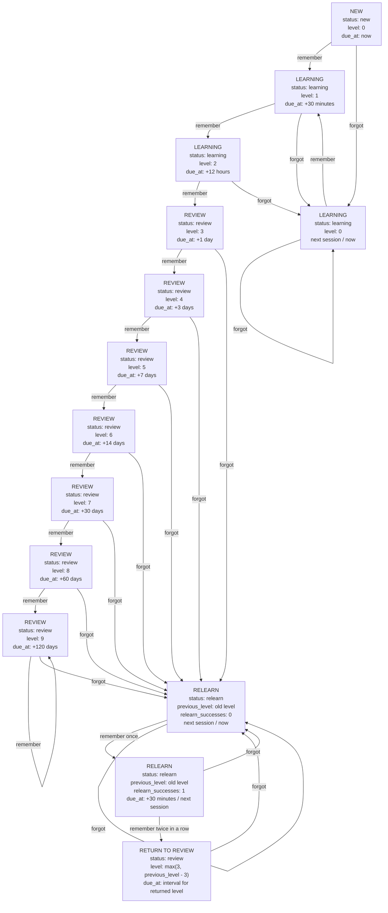

# Spaced Repetition Algorithms and Review Queue Proposal

This document summarizes common spaced repetition approaches and proposes a simple version for NotAnotherCards.

## 1. Existing Spaced Repetition Approaches

### 1.1 Level-Based Fixed Intervals

This is the simplest spaced repetition approach.

Main idea:

```text
each card has a level
each level has a fixed review interval
```

Example:

| Level | Meaning | Next interval |
| ----: | ------- | ------------- |
| 0 | New / failed | now |
| 1 | Very weak | 30 minutes |
| 2 | Weak | 12 hours |
| 3 | Early learning | 1 day |
| 4 | Some memory | 3 days |
| 5 | Getting stable | 7 days |
| 6 | Stable | 14 days |
| 7 | Strong | 30 days |
| 8 | Very strong | 60 days |
| 9 | Mature | 120 days |

If the user remembers the card:

```text
level = level + 1
```

If the user forgets the card:

```text
level goes down
```

This group includes fixed interval schedules and Leitner-style systems.

The Leitner system uses boxes:

```text
Box 1 = review very often
Box 2 = review less often
Box 3 = review even less often
```

There are two common ways to handle mistakes:

```text
strict reset:
forgot -> level = 0
```

or:

```text
soft penalty:
forgot -> level decreases by 1-3 levels
```

For NotAnotherCards, we use a separate `relearn` status instead of a simple level penalty. If the user forgets a mature card once, it does not become completely new, but it must be reviewed soon.

Used by / similar to:

- DuoCards
- Memrise
- Leitner-based flashcard systems

DuoCards documents this interval sequence:

```text
90 seconds -> 30 minutes -> 12 hours -> 2 days -> 2 weeks -> 2 months
```

DuoCards also mentions that vocabulary is practiced from both sides and with listening tests.

Memrise documents this interval sequence:

```text
4 hours -> 12 hours -> 24 hours -> 6 days -> 12 days -> 48 days -> 96 days -> 6 months
```

If the user answers incorrectly in Memrise, the item is moved back to the first interval.

Pros:

- very easy to understand;
- easy to implement;
- easy to test;
- works well with swipe-based UI;
- good for a first version.

Cons:

- not very personalized;
- does not deeply model memory;
- with only two answers, Remember/Forgot, it cannot know whether recall was easy or hard.

Sources:

- DuoCards FAQ: https://duocards.com/en/faqs/
- Memrise SRS: https://memrise.zendesk.com/hc/en-us/articles/360015889057-How-does-the-spaced-repetition-system-work

### 1.2 User-Rated Adaptive Scheduling

This group uses the user's answer quality to adapt intervals.

Main idea:

```text
the user does not only say Remember/Forgot
the user says how well they remembered
```

Common answer options:

```text
Again = forgot / incorrect
Hard  = correct but difficult
Good  = correct with normal effort
Easy  = correct and easy
```

This group includes:

- SM-2 / SuperMemo-style scheduling;
- Anki answer buttons;
- FSRS - Free Spaced Repetition Scheduler;
- Brainscape confidence-based repetition (Brainscape app).

Pros:

- more adaptive than fixed intervals;
- can consider card difficulty;
- gives the algorithm more information than Remember/Forgot;
- powerful for large collections.

Cons:

- more complex;
- requires more user input;
- four or five answer options may be too much friction for the first swipe-based UI;
- FSRS is difficult to implement correctly from scratch unless we use an existing library.

Sources:

- SuperMemo method: https://www.supermemo.com/en/faq/what-is-the-supermemo-method
- SuperMemo algorithm history: https://www.super-memory.org/archive/help/smalg.htm
- Anki studying: https://docs.ankiweb.net/studying.html
- Anki reverse cards: https://docs.ankiweb.net/templates/generation.html
- Anki deck options / FSRS: https://docs.ankiweb.net/deck-options
- Brainscape algorithm: https://brainscape.zendesk.com/hc/en-us/articles/13103043051149-How-Does-Brainscape-s-Spaced-Repetition-Algorithm-Work

### 1.3 Data-Driven Predictive Scheduling

This group tries to predict when the user will forget an item based on data.

Main idea:

```text
the system learns from many review events
then predicts the best next review time
```

Example:

Duolingo uses Half-Life Regression in its spaced repetition research.

The idea:

```text
each word has a predicted memory half-life
```

The half-life is the estimated time after which the chance of remembering becomes much lower.

Duolingo uses large-scale user data and machine learning to predict when a word should be practiced again.

Pros:

- very adaptive;
- data-driven;
- strong for large platforms with many users and many learning events.

Cons:

- requires a lot of data;
- complex;
- not realistic for our first version.

Sources:

- Duolingo research article: https://blog.duolingo.com/how-we-learn-how-you-learn/
- Duolingo spaced repetition overview: https://blog.duolingo.com/spaced-repetition-for-learning/

## 2. Card Direction and Test Types

For language learning, one word can be tested in several ways.

### 2.1 Recognition

The app shows:

```text
target language word
```

The user recalls:

```text
native language meaning
```

This is usually easier.

### 2.2 Production

The app shows:

```text
native language meaning
```

The user recalls:

```text
target language word
```

This is usually harder and should probably appear after the user has some recognition progress.

### 2.3 Listening

The app plays:

```text
audio / pronunciation
```

The user recalls:

```text
meaning
```

This is important for real language use.

### 2.4 Context

The app shows:

```text
a sentence with the studied word highlighted
```

The user recalls:

```text
meaning in context
```

This should appear later, after the basic word is not completely new.

## 3. Review Queue Approaches

There are two separate concepts:

```text
due pool
session queue
```

### 3.1 Due Pool

The due pool is all cards that should be reviewed now.

A card is due when:

```text
due_at <= now
```

Example:

```text
card A due_at = yesterday  -> due
card B due_at = now        -> due
card C due_at = tomorrow   -> not due yet
```

### 3.2 Session Queue

The session queue is the concrete list of cards selected for the current review session.

Example:

```text
1. take all due cards;
2. sort them;
3. take a fixed number of cards;
4. review these cards in this session.
```

Possible sorting rules:

```text
oldest due first
lowest level first
mix of due reviews and new cards
randomized within priority groups
```

### 3.3 New Words

New words are words that the user has just added or has not started learning yet.

Possible approaches:

#### Option A - New words appear in the next session

If the current session queue is already created, new words do not interrupt it.

The new word gets:

```text
status = new
level = 0
due_at = now
```

It appears in the next session or after the current queue is completed.

Pros:

- stable session;
- simple implementation;
- no surprise jumps in the current queue.

Cons:

- the user may not see the new word immediately.

#### Option B - New words are appended to the current session

If the user adds a new word during a session, it is added to the end of the current queue.

Pros:

- the user can practice it soon.

Cons:

- session length changes while studying;
- more complex logic.

#### Option C - New words are inserted immediately

The new word appears as the next card.

Pros:

- immediate practice.

Cons:

- can be annoying;
- interrupts the review flow;
- not recommended for the first version.

### 3.4 Words With Reset Progress

Reset progress means:

```text
the word already exists,
but the user realizes they do not remember it
```

Example:

```text
User tries to add "Haus".
The app says: this word already exists.
The user realizes: I do not remember this word at all.
The user resets progress.
```

Possible reset behavior:

```text
level = 0
due_at = now
status = learning
```

We should not necessarily delete old review history. Instead, we can add a review event:

```text
event_type = manual_reset
```

This preserves useful statistics:

```text
how often users reset words
which words are often forgotten after being considered learned
```

Queue behavior for reset words should follow the priority pool rules.

Recommended simple behavior:

```text
reset words become priority cards
they are selected after cards forgotten in the previous session
```

## 4. Proposed First Version for NotAnotherCards

### 4.1 Use a Level-Based Algorithm

We should start with a simple level-based spaced repetition algorithm.

This is similar to a level-based fixed interval system.

Each user card has:

```text
status
level
due_at
previous_level
relearn_successes
last_result
last_session_id
reset_at
```

Recommended database fields for `user_cards`:

| Field | Type | Required | Default value | Meaning |
| ----- | ---- | -------- | ------------- | ------- |
| `status` | text | not null | `new` | Current learning mode: `new`, `learning`, `review`, or `relearn`. |
| `level` | integer | not null | `0` | Current learning level from `0` to `9`. |
| `due_at` | timestamp with time zone | not null | `now()` | When the card can be selected again. `new` cards still wait for the `new` priority group. |
| `previous_level` | integer | nullable | `null` | Used only for `relearn`. Stores the old review level before the user forgot the card. |
| `relearn_successes` | integer | not null | `0` | Number of successful `relearn` answers in a row. |
| `last_result` | text | nullable | `null` | Last answer result: `remembered`, `forgot`, or `manual_reset`. |
| `last_session_id` | text / uuid | nullable | `null` | The session where the card was last answered. |
| `reset_at` | timestamp with time zone | nullable | `null` | When the user manually reset the card. |

Suggested levels:

| Level | Next interval |
| ----: | ------------- |
| 0     | now / next session |
| 1     | 30 minutes |
| 2     | 12 hours |
| 3     | 1 day |
| 4     | 3 days |
| 5     | 7 days |
| 6     | 14 days |
| 7     | 30 days |
| 8     | 60 days |
| 9     | 120 days |

### 4.2 Card Statuses

Each card has one current status.

| Status | Meaning |
| ------ | ------- |
| `new` | The card was added, but the user has not started learning it yet. |
| `learning` | The card is on levels `0-2`. |
| `review` | The card is on levels `3-9`. |
| `relearn` | The card was previously in `review`, but the user forgot it and now needs short recovery steps. |

Important distinction:

```text
forgot = an event from one answer
relearn = the current status of an old review card after it was forgotten
```

Manual reset is not a separate status.

Manual reset means:

```text
status = learning
level = 0
due_at = now
```

We also record this in the event history:

```text
review_events.result = manual_reset
```

### 4.3 Answer Rules

```text
Remember / swipe right
Forgot / swipe left
```

The full transition table:

| Current status | Current level | Action | New status | New level | Next show |
| -------------- | ------------- | ------ | ---------- | --------- | --------- |
| `new` | 0 | remember | `learning` | 1 | +30 minutes |
| `new` | 0 | forgot | `learning` | 0 | next session |
| `learning` | 0 | remember | `learning` | 1 | +30 minutes |
| `learning` | 1 | remember | `learning` | 2 | +12 hours |
| `learning` | 2 | remember | `review` | 3 | +1 day |
| `learning` | 0-2 | forgot | `learning` | 0 | next session |
| `review` | 3-8 | remember | `review` | current level + 1 | interval for new level |
| `review` | 9 | remember | `review` | 9 | +120 days |
| `review` | 3-9 | forgot | `relearn` | 0 | next session |
| `relearn` | 0, `relearn_successes = 0` | remember | `relearn` | 0, `relearn_successes = 1` | +30 minutes / next session |
| `relearn` | 0, `relearn_successes = 1` | remember | `review` | `max(3, previous_level - 3)` | interval for returned level |
| `relearn` | 0 | forgot | `relearn` | 0 | next session |
| any | any | manual reset | `learning` | 0 | next session |

For `review + forgot`, store:

```text
previous_level = old level
relearn_successes = 0
```

Example:

```text
review level 8
forgot
-> relearn
previous_level = 8
relearn_successes = 0

remember once
-> relearn_successes = 1

remember again
-> review level 5
because max(3, 8 - 3) = 5
```

Reasoning:

- a new or learning card that is forgotten should stay in early learning;
- a mature review card that is forgotten should return soon;
- but a mature forgotten card should not become completely new;
- `relearn` lets the user recall it twice in a row before returning it to `review` at a lower level.

### 4.4 Manual Reset Rule

Manual reset should be available when the user sees that a word already exists but they do not remember it.

Manual reset:

```text
level = 0
due_at = now
status = learning
```

Also create a review event:

```text
event_type = manual_reset
```

This gives us future statistics:

```text
resets per day
often reset words
words that were considered learned but failed in real life
```

### 4.5 Session Queue Rule

Default session size:

```text
10 cards
```

Strict queue priority:

```text
1. Add cards forgotten in the previous session.
2. Fill remaining slots with manually reset cards.
3. Fill remaining slots with other due learning/relearn cards.
4. Fill remaining slots with due/overdue review cards.
5. Fill remaining slots with new cards.
```

This means:

```text
forgotten cards from the previous session go first
manual reset cards go after forgotten cards
learning/relearn is more important than normal review
review is more important than new cards
new cards appear only when there is space
```

The session size always stays fixed:

```text
10 cards
```

If one priority group has more cards than available slots, we do not increase the session size. The remaining cards stay in the same priority group and will be picked for following sessions.

Example:

```text
Forgotten from previous session: 3
Manual reset: 1
Due learning/relearn: 2
Due review: 20
New: 100

Session:
3 forgotten
1 manual reset
2 due learning/relearn
4 due review
0 new
```

Another example:

```text
Forgotten from previous session: 0
Manual reset: 0
Due learning/relearn: 1
Due review: 4
New: 100

Session:
1 due learning/relearn
4 due review
5 new
```

If the user forgot all 10 cards in the previous session:

```text
Next session:
the same 10 forgotten cards
```

This is intentional. If the user forgot many cards, the first priority is to learn them again.

If the user forgot 10 cards and also manually reset 3 cards:

```text
Next session:
10 forgotten cards

Session after that:
3 manual reset cards
+ 7 cards from other priority groups
```

### 4.6 Priority Pool Data Model

The priority pool is not a separate card status.

It is the result of queue-building logic.

For the first version, keep fast queue-building fields in `user_cards`:

```text
status
level
due_at
last_result
last_session_id
reset_at
previous_level
relearn_successes
```

Field meanings:

| Field | Meaning |
| ----- | ------- |
| `status` | Current learning mode: `new`, `learning`, `review`, or `relearn`. |
| `level` | Current learning level from `0` to `9`. |
| `due_at` | When the card should be shown again. |
| `last_result` | Last answer result: `remembered`, `forgot`, or `manual_reset`. |
| `last_session_id` | The session where the card was last answered. This lets us find cards forgotten in the previous session. |
| `reset_at` | When the card was manually reset. If it is not `null`, the card can be treated as a manual reset priority card. Clear it after the card is selected and answered after reset. |
| `previous_level` | Used only for `relearn`. It stores the review level the card had before the user forgot it. |
| `relearn_successes` | How many successful answers in a row the card has in `relearn`. |

For history and analytics, also write events to `review_events`:

```text
card_id
session_id
result
level_before
level_after
status_before
status_after
reviewed_at
```

The queue can then be built like this:

```text
1. Take cards where:
   last_result = forgot
   last_session_id = previous_session_id

2. Then take cards where:
   reset_at is not null
   status = learning
   level = 0
   due_at <= now

3. Then take cards where:
   status in learning/relearn
   due_at <= now

4. Then take cards where:
   status = review
   due_at <= now

5. Then take cards where:
   status = new
```

Important rule:

```text
One card can appear only once in one session.
```

When we add cards from each priority group, we must exclude cards that are already selected.

Example:

```text
selected_card_ids = []

take forgotten cards
add their ids to selected_card_ids

take manual reset cards
exclude ids already in selected_card_ids

take due learning/relearn cards
exclude ids already in selected_card_ids

continue until the session has 10 unique cards
```

### 4.7 Status and Level Flow Diagram



Separate rule:

```text
Manual reset:
from any status -> learning level 0
due_at = now
add to priority pool
show as soon as possible by priority
```

After `RETURN_TO_REVIEW`, the card follows the normal review progression from its returned level.

### 4.8 Card Direction Progression

We should not show every test type immediately.

Language learning is not only remembering a translation.

The same word should be checked in different ways:

```text
target word -> native meaning
native meaning -> target word
audio -> meaning
context sentence -> meaning
```

These test types should not all appear immediately. A completely new word should first be learned in the easiest direction.

For the first version, the test type should be selected by level, not randomly.

Whenever the target word appears on screen, its audio should be played automatically.

Recommended progression:

| Level | Main test type | What the app shows | What the user recalls | Why |
| ----: | -------------- | ------------------ | --------------------- | --- |
| 0 | Recognition | Target word with audio | Native meaning | The easiest first contact with the word. |
| 1 | Recognition | Target word with audio | Native meaning | Reinforce basic understanding. |
| 2 | Listening | Audio | Native meaning | Start connecting sound and meaning. |
| 3 | Production | Native meaning | Target word | Begin active recall, not only recognition. |
| 4 | Production | Native meaning | Target word | Strengthen active recall. |
| 5 | Listening production | Audio | Target word | Check whether the user can recognize sound and recall spelling. |
| 6 | Context recognition | Sentence with highlighted word | Native meaning | Move closer to real language usage. |
| 7 | Context production | Sentence with highlighted word | Target word | Check whether the user can produce the word from context. |
| 8 | Listening production | Audio | Target word | Keep listening and spelling strong at high levels. |
| 9 | Context production | Sentence with highlighted word | Target word | Mature cards should be checked in realistic context. |

Simpler first implementation:

```text
Level 0:
target word with audio -> native meaning

Level 1:
target word with audio -> native meaning

Level 2:
audio -> native meaning

Level 3:
native meaning -> target word

Level 4:
native meaning -> target word

Level 5:
audio -> target word

Level 6:
sentence with highlighted word -> native meaning

Level 7:
sentence with highlighted word -> target word

Level 8:
audio -> target word

Level 9:
sentence with highlighted word -> target word
```

Reasoning:

Recognition is easier:

```text
Haus -> house
```

Production is harder:

```text
house -> Haus
```

Listening is also harder because the user cannot rely only on written form.

Context is the most realistic but should appear later:

```text
Ich wohne in einem Haus.
```

This makes the app more language-oriented than a basic flashcard app.
